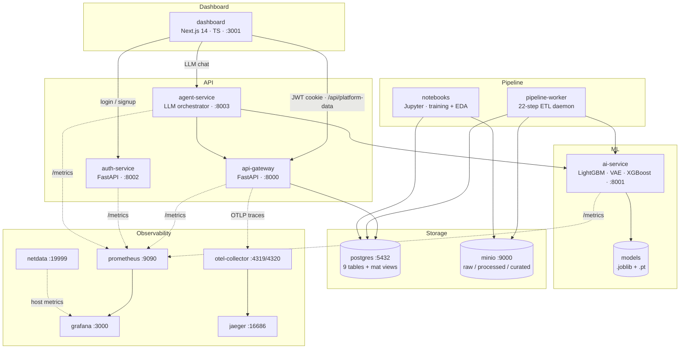

# C4 Level 2 — Containers

**Spirits & Mates** (logical, run inside ai-service + agent-service):

| Type | Name | Container |
|---|---|---|
| Spirit | ExperienceSpirit (CEM LightGBM) | ai-service |
| Spirit | NetworkSpirit (VAE) | ai-service |
| Spirit | UnderserviceSpirit (XGBoost) | ai-service |
| Spirit | ConvergenceSpirit (Granger) | pipeline-worker + api-gateway |
| Spirit | ActionSpirit (playbooks) | api-gateway + agent-service |
| Mate | NOCMate (LLM chat) | agent-service + dashboard l4-agent |
| Mate | AnalystMate (RCA narratives) | dashboard /intelligence |
| Mate | FieldMate (playbook explainability) | dashboard l4-agent execution tab |
