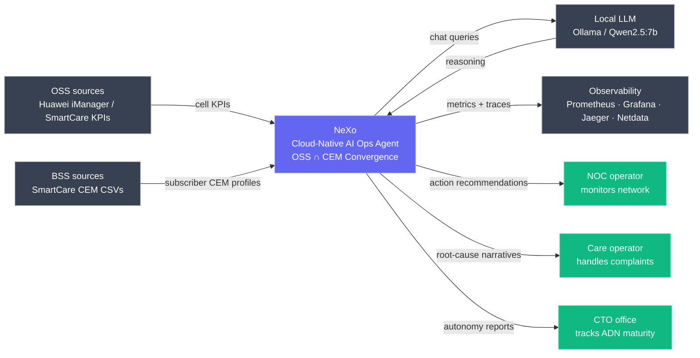

# C4 Level 1 — System Context

```mermaid
flowchart LR
    classDef ext fill:#374151,stroke:#9ca3af,color:#fff
    classDef sys fill:#6366f1,stroke:#a5b4fc,color:#fff
    classDef person fill:#10b981,stroke:#6ee7b7,color:#fff

    NOC[NOC operator<br/>monitors network]:::person
    CARE[Care operator<br/>handles complaints]:::person
    CTO[CTO office<br/>tracks ADN maturity]:::person

    OSS[OSS sources<br/>Huawei iManager / SmartCare KPIs]:::ext
    BSS[BSS sources<br/>SmartCare CEM CSVs]:::ext
    LLM[Local LLM<br/>Ollama / Qwen2.5:7b]:::ext
    OBS[Observability<br/>Prometheus · Grafana · Jaeger · Netdata]:::ext

    NEXO[NeXo<br/>Cloud-Native AI Ops Agent<br/>OSS ∩ CEM Convergence]:::sys

    OSS -->|cell KPIs| NEXO
    BSS -->|subscriber CEM profiles| NEXO
    NEXO -->|chat queries| LLM
    LLM -->|reasoning| NEXO
    NEXO -->|metrics + traces| OBS
    NEXO -->|action recommendations| NOC
    NEXO -->|root-cause narratives| CARE
    NEXO -->|autonomy reports| CTO
```

**Reading:** NeXo is the only system in scope; the four external systems and three personas are explicitly out-of-build.
