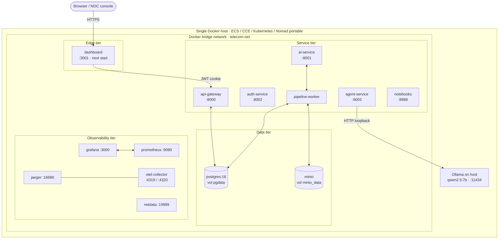

# Physical Deployment — Cloud-Native (no HCS lock-in)

**Cloud-native properties claimed:**

| Property | Evidence |
|---|---|
| 12-factor (config in env) | `.env.example`, `docker-compose.yml` env stanzas |
| Stateless services | All FastAPI services rebuild from PG state on restart |
| Horizontal scalability | Each service is a stateless container with health endpoint |
| Observability | `/metrics` on every FastAPI + OTLP traces + Netdata + Jaeger |
| Reproducibility | `Dockerfile` + `requirements.txt` per service + GitHub Actions CI |
| Portability | Identical compose runs on Docker desktop, ECS, CCE, Kubernetes, Nomad |

**Out-of-scope:** Huawei Cloud Stack OBS/RDS/ECS mapping. Removed from defense narrative; appendix-only.
