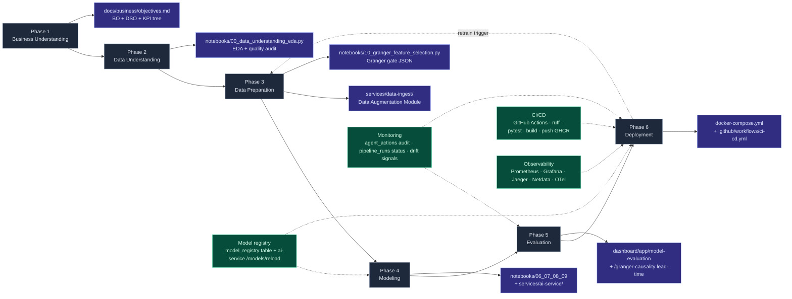

# ML Lifecycle — CRISP-DM × MLOps Overlay

**Reading:**

* The horizontal arrow chain is **CRISP-DM** (academic spine).
* The four green ops boxes are **MLOps overlay** (industrial evidence).
* Each phase maps to a real artifact path in the repo.
* The dashed back-arrow from Phase 6 → Phase 3 is the retrain loop: monitoring detects drift → Granger gate is rerun → models retrained on the updated feature set.
