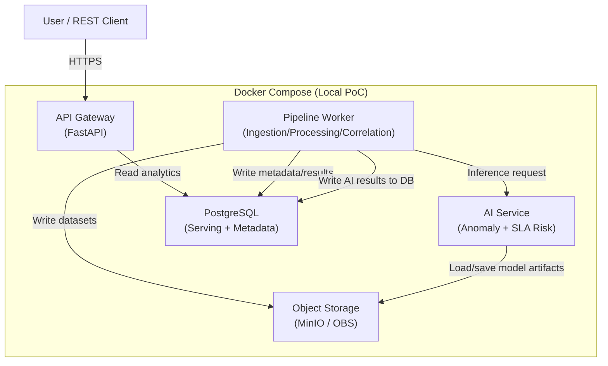
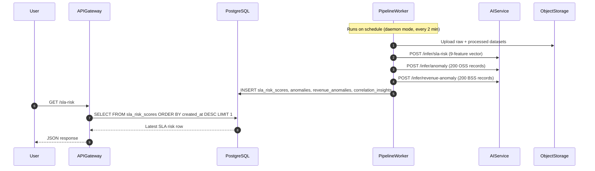

```mermaid
flowchart TB
  User["User / REST Client"]

  subgraph Docker["Docker Compose (Local PoC)"]
    APIGW["API Gateway\n(FastAPI)"]
    PIPE["Pipeline Worker\n(Ingestion/Processing/Correlation)"]
    AI["AI Service\n(Anomaly + SLA Risk)"]
    DB["PostgreSQL\n(Serving + Metadata)"]
    OBJ["Object Storage\n(MinIO / OBS)"]
  end

  User -->|HTTPS| APIGW
  APIGW -->|Read analytics| DB

  PIPE -->|Write datasets| OBJ
  PIPE -->|Write metadata/results| DB
  PIPE -->|Inference request| AI
  PIPE -->|Write AI results to DB| DB

  AI -->|Load/save model artifacts| OBJ
```

```mermaid
sequenceDiagram
  autonumber
  participant U as User
  participant G as APIGateway
  participant P as PostgreSQL
  participant W as PipelineWorker
  participant A as AIService
  participant O as ObjectStorage

  Note over W: Runs on schedule (daemon mode, every 2 min)
  W->>O: Upload raw + processed datasets
  W->>A: POST /infer/sla-risk (9-feature vector)
  W->>A: POST /infer/anomaly (200 OSS records)
  W->>A: POST /infer/revenue-anomaly (200 BSS records)
  W->>P: INSERT sla_risk_scores, anomalies, revenue_anomalies, correlation_insights

  U->>G: GET /sla-risk
  G->>P: SELECT FROM sla_risk_scores ORDER BY created_at DESC LIMIT 1
  P-->>G: Latest SLA risk row
  G-->>U: JSON response
```
