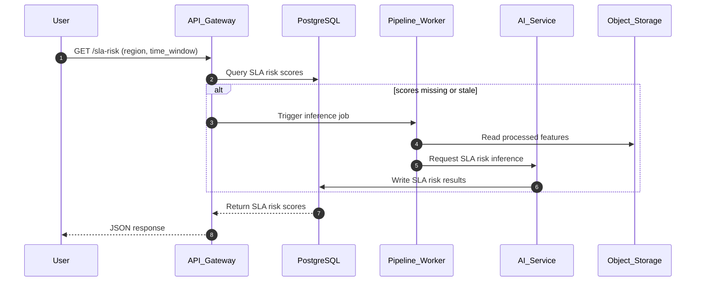

```mermaid
sequenceDiagram
  autonumber
  participant U as User
  participant G as API_Gateway
  participant P as PostgreSQL
  participant W as Pipeline_Worker
  participant A as AI_Service
  participant O as Object_Storage

  U->>G: GET /sla-risk (region, time_window)
  G->>P: Query SLA risk scores

  alt scores missing or stale
    G->>W: Trigger inference job
    W->>O: Read processed features
    W->>A: Request SLA risk inference
    A->>P: Write SLA risk results
  end

  P-->>G: Return SLA risk scores
  G-->>U: JSON response
```
