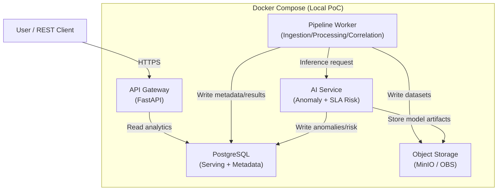
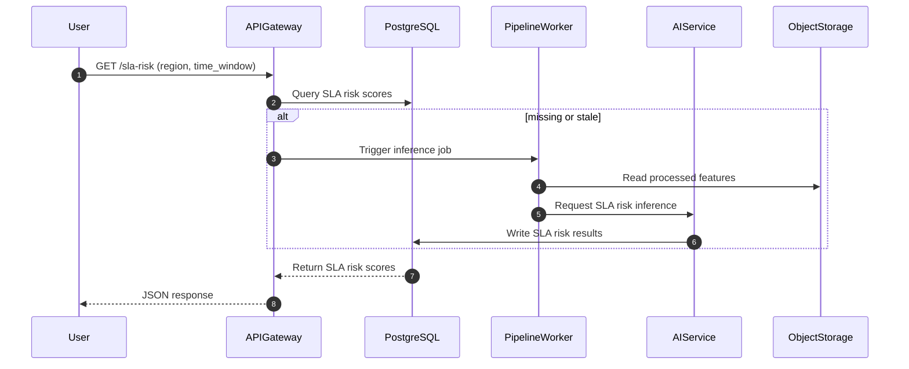

```mermaid
flowchart TB
  User["User / REST Client"]

  subgraph Docker["Docker Compose (Local PoC)"]
    APIGW["API Gateway\n(FastAPI)"]
    PIPE["Pipeline Worker\n(Ingestion/Processing/Correlation)"]
    AI["AI Service\n(Anomaly + SLA Risk)"]
    DB["PostgreSQL\n(Serving + Metadata)"]
    OBJ["Object Storage\n(MinIO / OBS)"]
  end

  User -->|HTTPS| APIGW
  APIGW -->|Read analytics| DB

  PIPE -->|Write datasets| OBJ
  PIPE -->|Write metadata/results| DB
  PIPE -->|Inference request| AI

  AI -->|Write anomalies/risk| DB
  AI -->|Store model artifacts| OBJ
```

```mermaid
sequenceDiagram
  autonumber
  participant U as User
  participant G as APIGateway
  participant P as PostgreSQL
  participant W as PipelineWorker
  participant A as AIService
  participant O as ObjectStorage

  U->>G: GET /sla-risk (region, time_window)
  G->>P: Query SLA risk scores
  alt missing or stale
    G->>W: Trigger inference job
    W->>O: Read processed features
    W->>A: Request SLA risk inference
    A->>P: Write SLA risk results
  end
  P-->>G: Return SLA risk scores
  G-->>U: JSON response
```
