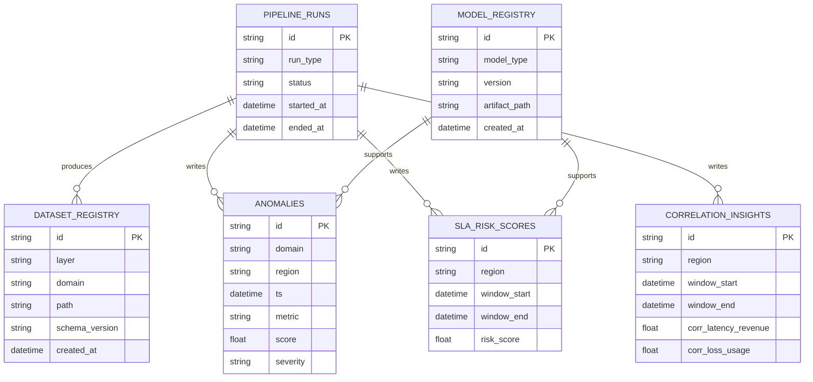

```mermaid
erDiagram
  DATASET_REGISTRY {
    string id PK
    string layer
    string domain
    string path
    string schema_version
    datetime created_at
  }

  PIPELINE_RUNS {
    string id PK
    string run_type
    string status
    datetime started_at
    datetime ended_at
  }

  ANOMALIES {
    string id PK
    string domain
    string region
    datetime ts
    string metric
    float score
    string severity
  }

  SLA_RISK_SCORES {
    string id PK
    string region
    datetime window_start
    datetime window_end
    float risk_score
  }

  CORRELATION_INSIGHTS {
    string id PK
    string region
    datetime window_start
    datetime window_end
    float corr_latency_revenue
    float corr_loss_usage
  }

  MODEL_REGISTRY {
    string id PK
    string model_type
    string version
    string artifact_path
    datetime created_at
  }

  PIPELINE_RUNS ||--o{ DATASET_REGISTRY : produces
  PIPELINE_RUNS ||--o{ ANOMALIES : writes
  PIPELINE_RUNS ||--o{ SLA_RISK_SCORES : writes
  PIPELINE_RUNS ||--o{ CORRELATION_INSIGHTS : writes
  MODEL_REGISTRY ||--o{ ANOMALIES : supports
  MODEL_REGISTRY ||--o{ SLA_RISK_SCORES : supports
```