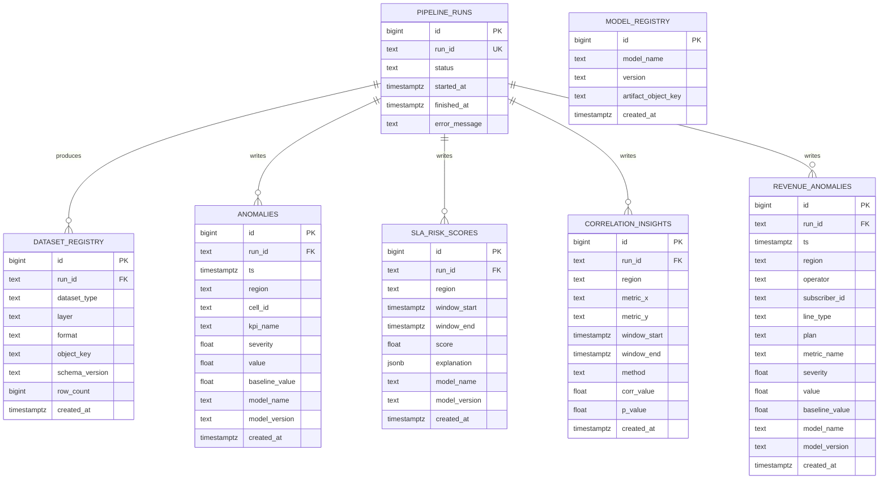

```mermaid
erDiagram
  PIPELINE_RUNS {
    bigint id PK
    text run_id UK
    text status
    timestamptz started_at
    timestamptz finished_at
    text error_message
  }

  DATASET_REGISTRY {
    bigint id PK
    text run_id FK
    text dataset_type
    text layer
    text format
    text object_key
    text schema_version
    bigint row_count
    timestamptz created_at
  }

  MODEL_REGISTRY {
    bigint id PK
    text model_name
    text version
    text artifact_object_key
    timestamptz created_at
  }

  ANOMALIES {
    bigint id PK
    text run_id FK
    timestamptz ts
    text region
    text cell_id
    text kpi_name
    float severity
    float value
    float baseline_value
    text model_name
    text model_version
    timestamptz created_at
  }

  SLA_RISK_SCORES {
    bigint id PK
    text run_id FK
    text region
    timestamptz window_start
    timestamptz window_end
    float score
    jsonb explanation
    text model_name
    text model_version
    timestamptz created_at
  }

  CORRELATION_INSIGHTS {
    bigint id PK
    text run_id FK
    text region
    text metric_x
    text metric_y
    timestamptz window_start
    timestamptz window_end
    text method
    float corr_value
    float p_value
    timestamptz created_at
  }

  REVENUE_ANOMALIES {
    bigint id PK
    text run_id FK
    timestamptz ts
    text region
    text operator
    text subscriber_id
    text line_type
    text plan
    text metric_name
    float severity
    float value
    float baseline_value
    text model_name
    text model_version
    timestamptz created_at
  }

  PIPELINE_RUNS ||--o{ DATASET_REGISTRY : produces
  PIPELINE_RUNS ||--o{ ANOMALIES : writes
  PIPELINE_RUNS ||--o{ SLA_RISK_SCORES : writes
  PIPELINE_RUNS ||--o{ CORRELATION_INSIGHTS : writes
  PIPELINE_RUNS ||--o{ REVENUE_ANOMALIES : writes
```
