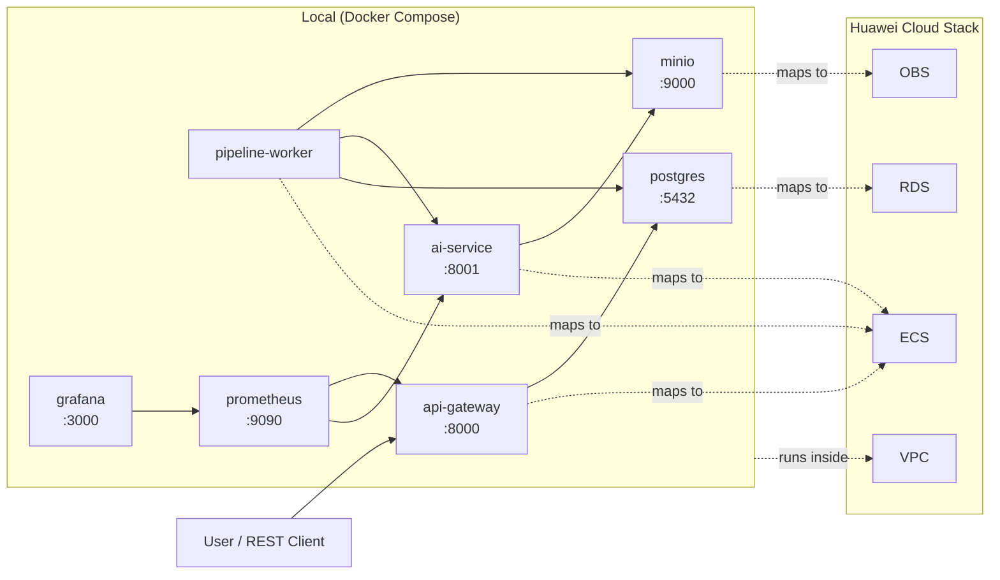

# WSL2 stability notes

If Docker Desktop / WSL2 crash a few minutes after startup, the WSL2 VM is running out of RAM.

## Quick fix

1. Copy the example config to your Windows user profile:

   ```bash
   cp .wslconfig.example /mnt/c/Users/$USER/.wslconfig
   ```

2. Shut down WSL2 from Windows PowerShell (Admin):

   ```powershell
   wsl --shutdown
   ```

3. Wait ~10 seconds, then reopen WSL2.

4. Verify the new memory limit:

   ```bash
   free -h
   ```

   You should see ~24GB total (if your host has 32GB). If your host has 16GB, edit `.wslconfig` to `memory=12GB` instead.

## Start the stack safely

Use the preflight-aware target so startup is aborted if RAM is still too low:

```bash
make start-safe
```

## What changed (2026-06-16)

- `.wslconfig`: 24GB RAM + 8GB swap + 5 processors.
- `retrain-service` is now opt-in (`docker compose --profile retrain up -d retrain-service`) — it was the biggest memory consumer.
- `notebooks` now has a 2GB memory limit.
- Core services have `restart: unless-stopped`.
- `scripts/wsl-preflight.sh` checks WSL RAM before startup.

## Resource budget

This machine has **~20GB physical RAM**. WSL2 is capped at **12GB** to leave room for Windows, Chrome, VS Code, and Docker Desktop overhead.

| Scenario | Minimum WSL RAM |
|----------|-----------------|
| Defense mode (`make start-defense`) | ~7GB |
| Full core stack (`make start-safe`) | ~7GB |
| Core + monitoring profile | +~2GB |
| On-demand retrain | +~3GB while running |

**Ollama is removed** — the L4 Agent now uses OpenRouter cloud LLM, which uses zero local RAM and is much faster for demos.

## Port conflicts

If `make start-safe` fails with `failed to bind host port ...: address already in use`, something on your machine is already using a port NeXo needs.

Required ports: `5432 8000 8001 8002 8003 8888 9000 9001 3001`.

Common culprits:

- **Jupyter kernel on port 9000** (seen with VS Code ipykernel). Find it with `lsof -i :9000` or `netstat -ano | findstr :9000` on Windows, then stop the kernel.
- **Another MinIO** already running.
- **Stale `wslrelay.exe`** holding the port after a crash. Kill it from Windows Task Manager or PowerShell: `Stop-Process -Name wslrelay -Force`, then restart WSL.

The preflight script now detects these conflicts before Docker tries to bind them.

## Dashboard not reachable on `localhost:3001`

On some WSL2 builds with **mirrored networking**, Docker ports are bound inside WSL but are not published to Windows `localhost`.

Symptom: `curl http://127.0.0.1:3001/login` works inside WSL, but the browser on Windows gets `ERR_CONNECTION_REFUSED` for `http://localhost:3001`.

### Fix

The `.wslconfig` now forces `networkingMode=NAT` instead of mirrored mode. Restart WSL:

```powershell
wsl --shutdown
# wait 10 seconds
wsl
```

After restart, `http://localhost:3001` should work from Windows.

### Temporary workaround (before restart)

Use the WSL VM IP directly. Find it with:

```bash
ip addr show eth0 | grep 'inet ' | awk '{print $2}' | cut -d/ -f1
```

Then open `http://<WSL_IP>:3001` in Windows.
