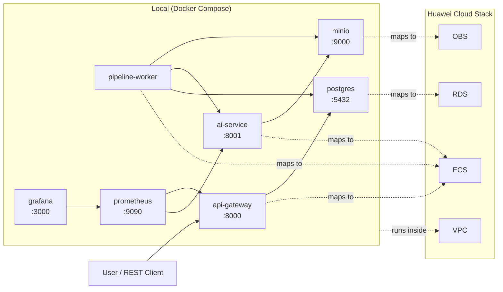

```mermaid
flowchart LR
  subgraph Local["Local (Docker Compose)"]
    APIGW["api-gateway\n:8000"]
    PIPE["pipeline-worker"]
    AI["ai-service\n:8001"]
    DB["postgres\n:5432"]
    OBJ["minio\n:9000"]
    PROM["prometheus\n:9090"]
    GRAF["grafana\n:3000"]
  end

  User["User / REST Client"] --> APIGW
  APIGW --> DB
  PIPE --> OBJ
  PIPE --> AI
  PIPE --> DB
  AI --> OBJ
  PROM --> APIGW
  PROM --> AI
  GRAF --> PROM

  subgraph HCS["Huawei Cloud Stack"]
    ECS["ECS"]
    OBS["OBS"]
    RDS["RDS"]
    VPC["VPC"]
  end

  APIGW -.maps to .-> ECS
  PIPE  -.maps to .-> ECS
  AI    -.maps to .-> ECS
  OBJ   -.maps to .-> OBS
  DB    -.maps to .-> RDS
  Local -.runs inside .-> VPC
```