# Mermaid Diagrams for Presentation Slides

All diagrams below are in Mermaid syntax. Paste directly into Dokie AI, Mermaid Live Editor, or any Mermaid-supporting tool.

---

## 1. Industrial Positioning: CEM - AI Agent - CVM

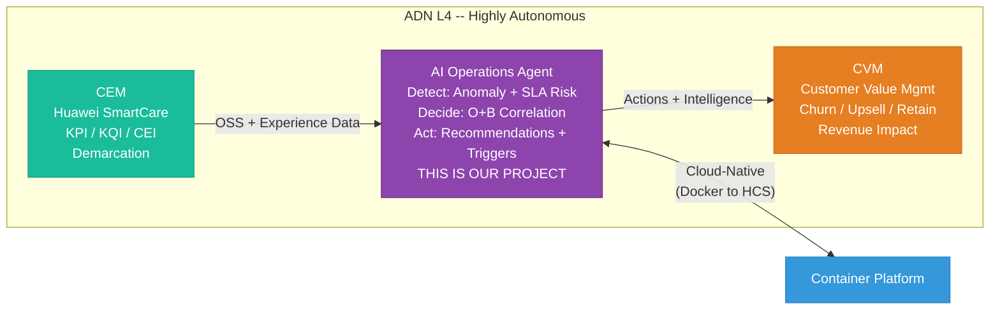

---

## 2. Container Architecture (5 Services)

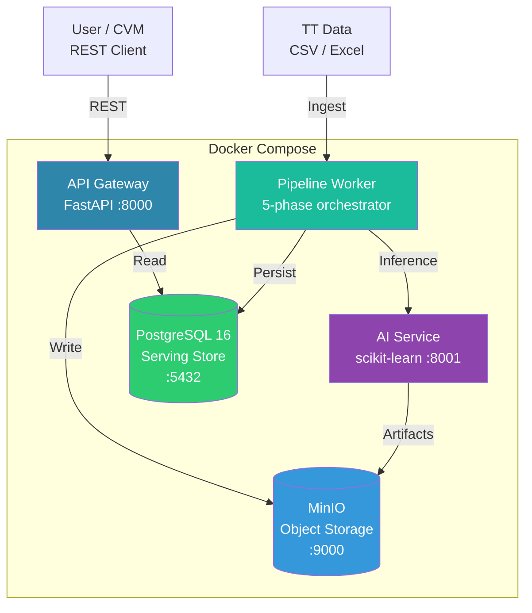

---

## 3. 5-Phase Pipeline

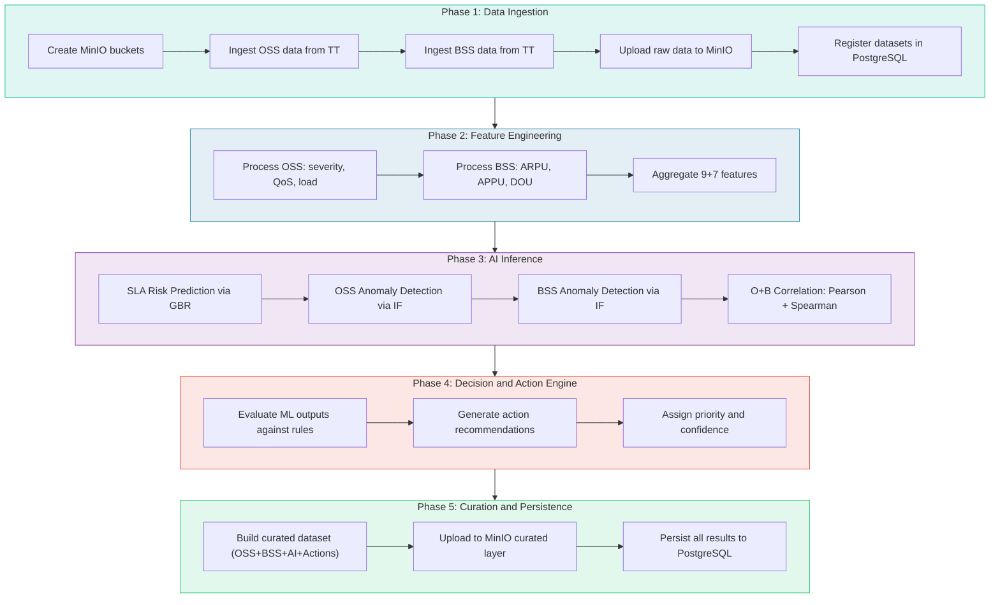

---

## 4. Three-Layer Data Lake

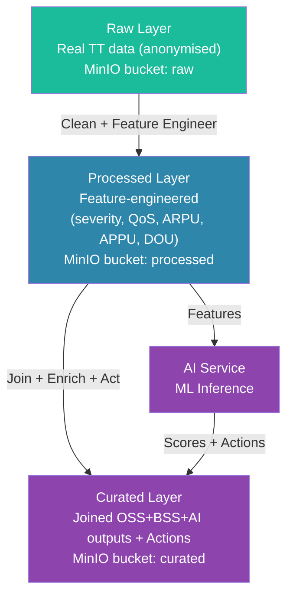

---

## 5. ML Model Pipeline with Action Engine

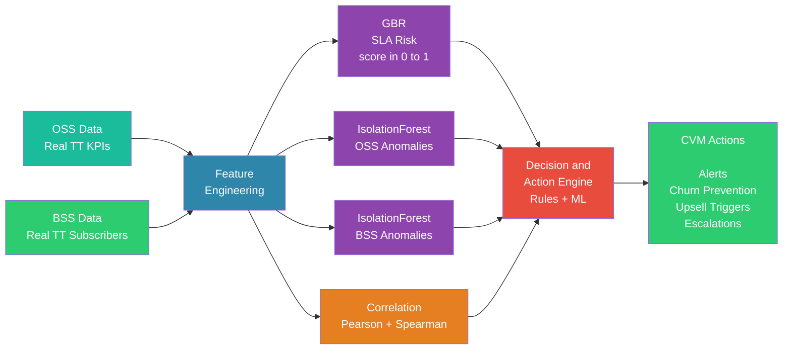

---

## 6. Data Ingestion Flow

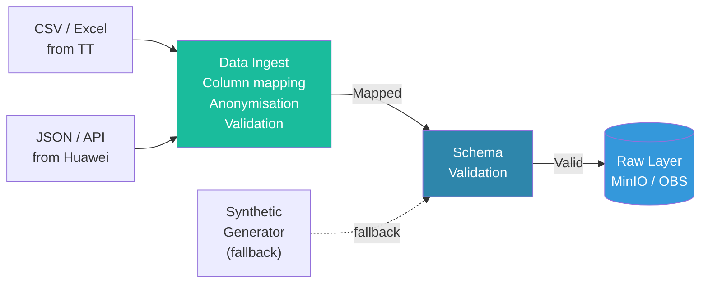

---

## 7. ER Diagram (8 Tables)

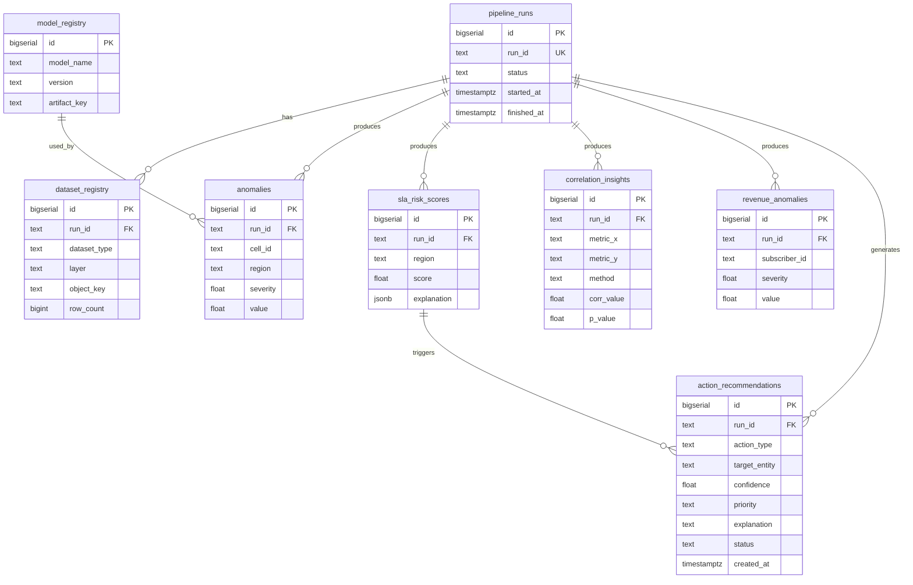

---

## 8. HCS Mapping (Docker to Cloud)

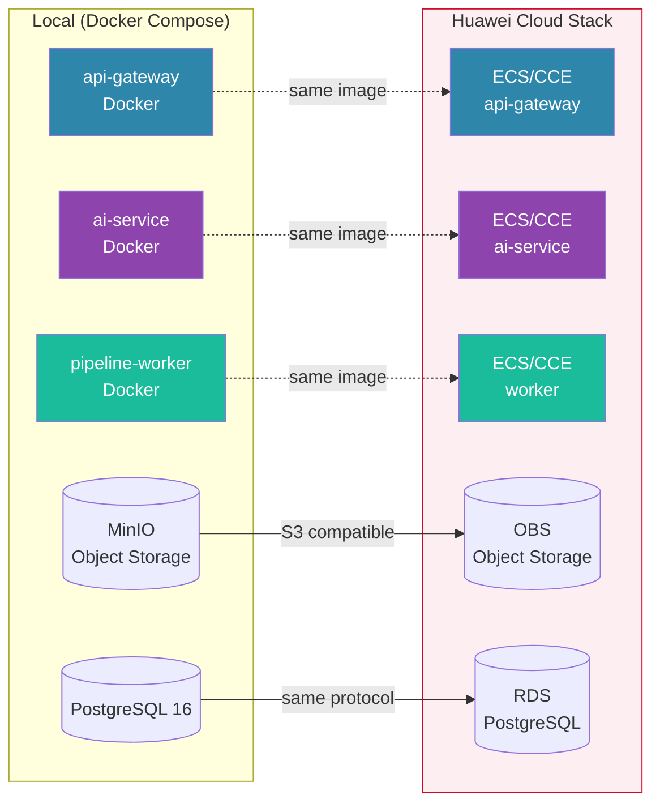

---

## 9. HCS Target Architecture

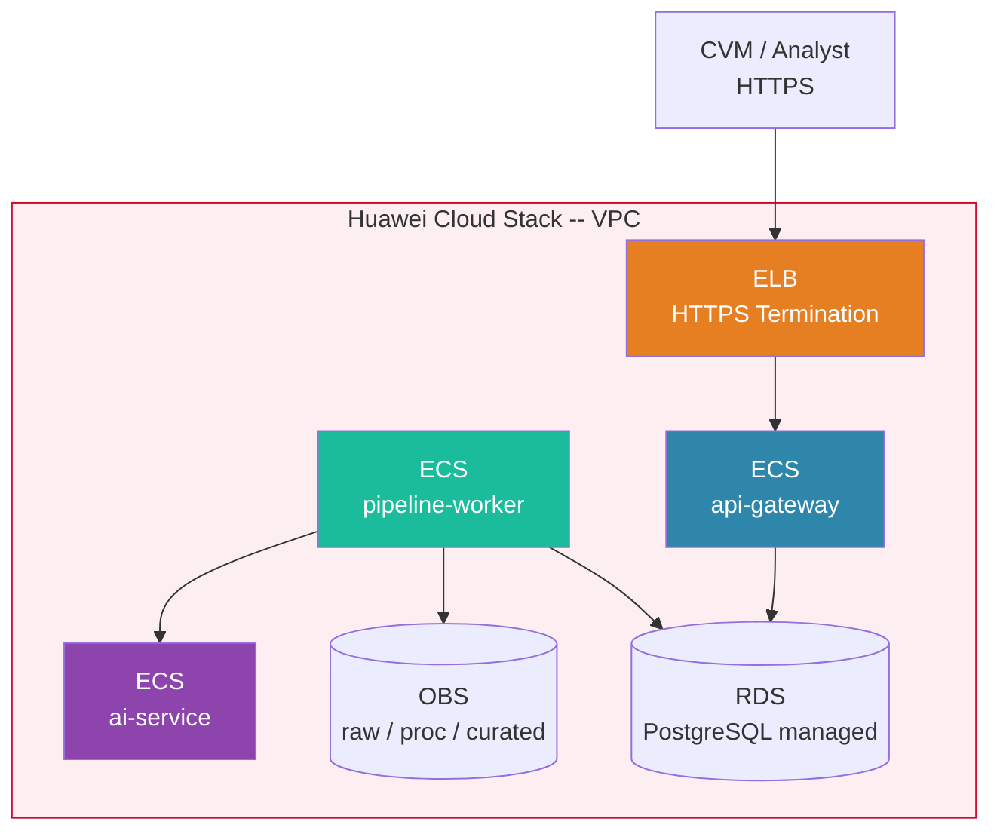

---

## 10. Gap Analysis

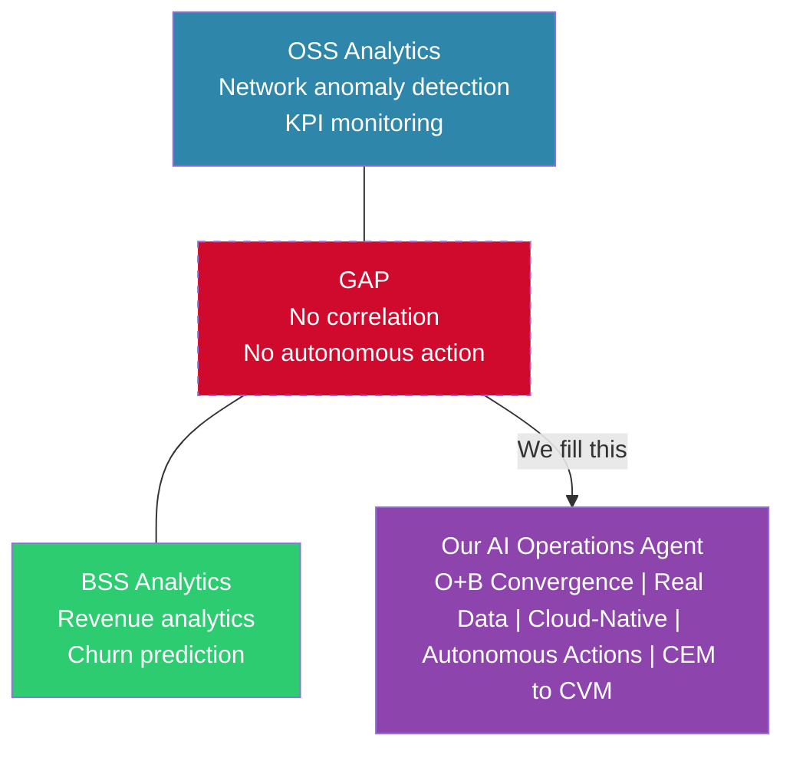

---

## 11. ADN Autonomy Levels

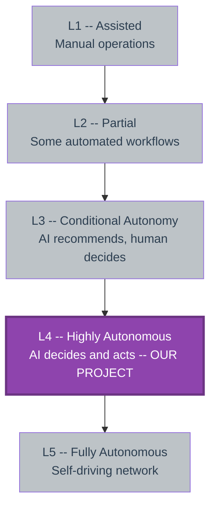

---

## 12. O+B Correlation Pairs

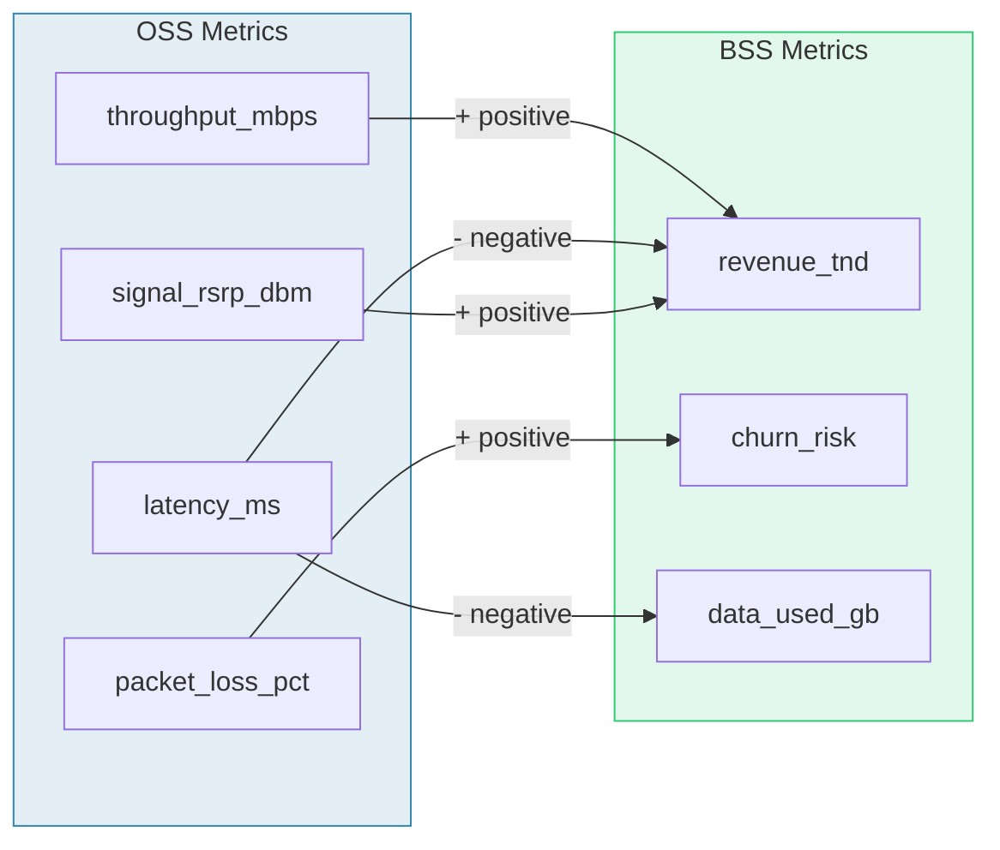

---

## 13. Decision and Action Engine Rules

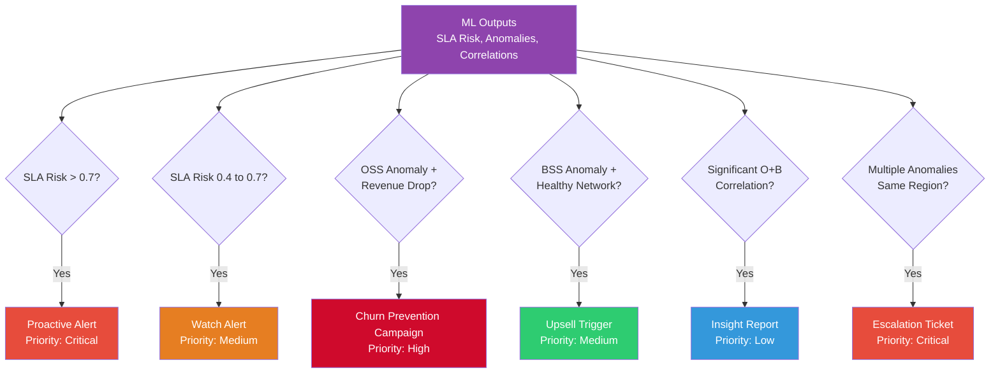

---

## 14. Use Case Diagram

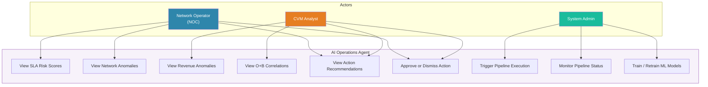

---

## 15. Sequence Diagram: Pipeline Execution with Action Generation

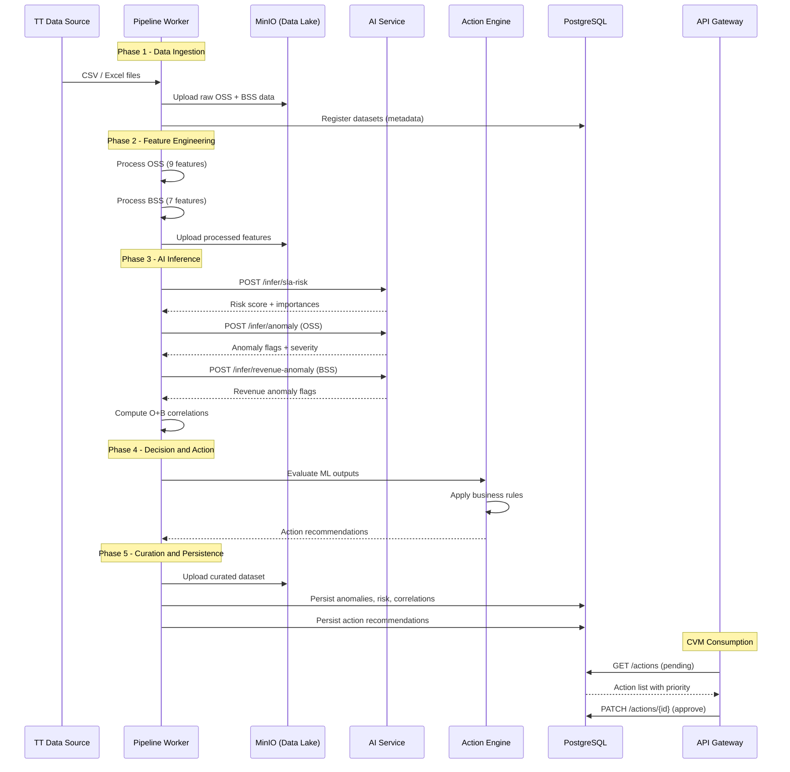

---

## 16. Sequence Diagram: Action Lifecycle

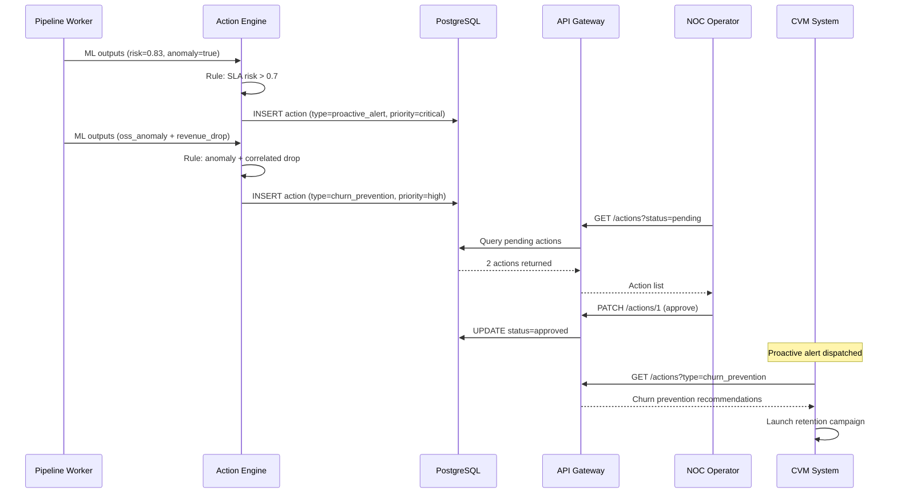

---

## 17. Competitive Comparison Matrix

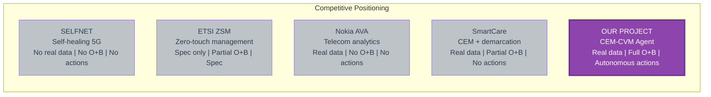
